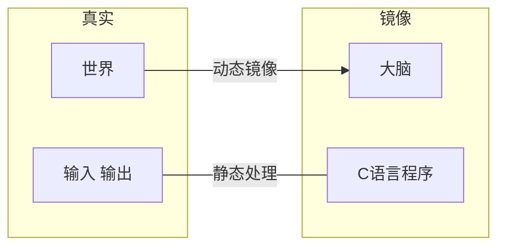
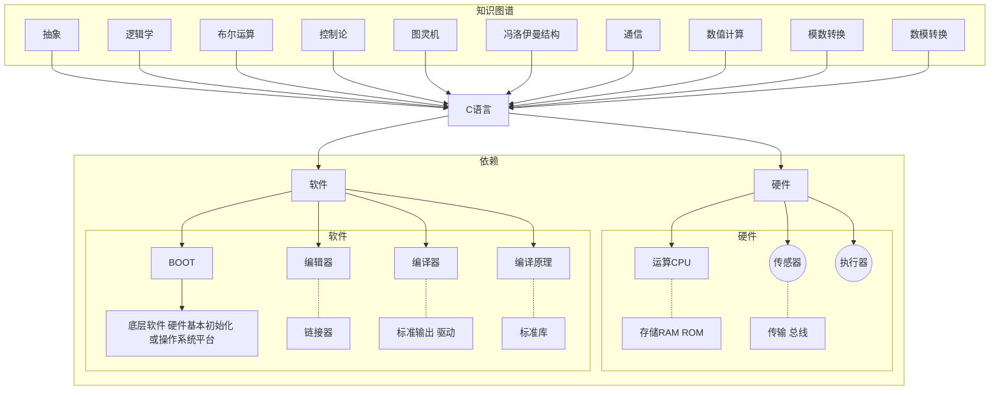
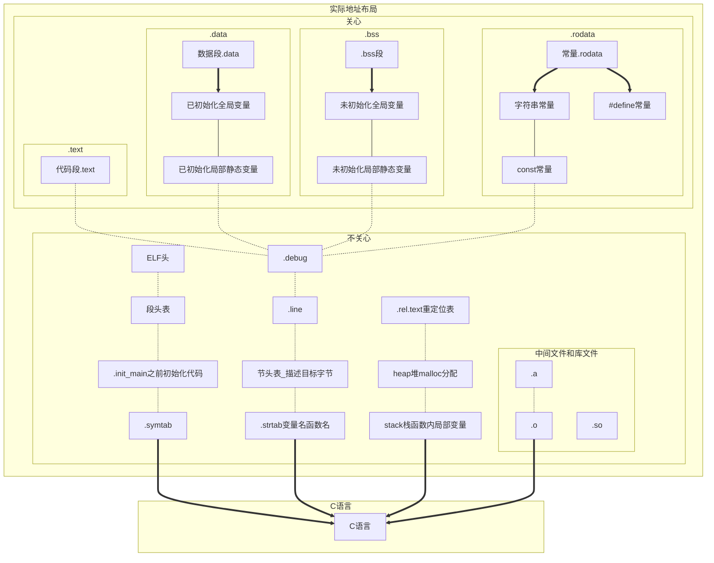
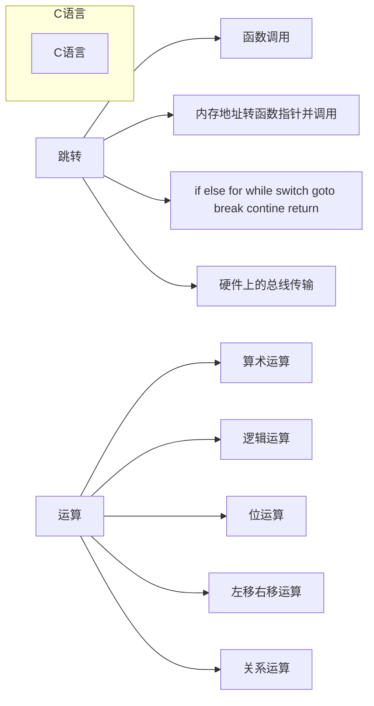

# C语言框架讲解   

---

(送书)整体介绍C语言，一期视频完整介绍C语言有用知识  

[b站配置视频地址](https://space.bilibili.com/106424039)  

|作者|将狼才鲸|
|---|---|
|日期|2021-07-17|

_注：gitee暂不支持markdown mermaid流程图显示，需要下载Typora等软件打开本.md文件才能查看流程图和框图_  
<br>

## 一、引出C语言  

<center>图1 主观理解</center>  


<center>图2 C语言关联事务</center>  



我假设人认知世界是将世界在大脑中动态的做了一个**镜像**，那么C语言程序就是将世界的信息做一个静态的处理，或者将处理的信息送出外界。  
**图灵机**，用机器模拟数学计算并且证明可行：动态数据 + 固定程序 + 状态和数据存储 + 顺序指针和跳转执行。  
**冯洛伊曼结构**： 指令和数据合并在一起（因此指针能调用函数，也能调用数据，也能调用寄存器，代码段和数据段本质上是一样的结构）。  

## 二、C语言功能  

<center>图3 C语言框架——数据布局</center>  



_注：不同编译器生成的地址布局名称不一样，这里以gcc举例，其它编译器大同小异_  

<br>

<center>图4 C语言框架——功能</center>  



if, else, else if, for, while, while do, do while, swith case, break, continue，goto, ,逗号运算符, ?:运算符本质上都是内存地址的跳转，实际上只用if和goto语句就能实现以上所有的功能；  
同理，只用汇编的JMP LJMP AJMP SJMP（51汇编）或者B BL BLX BX（ARM）指令也能实现C语言的上述功能。  

|关键字||||||||
|---|---|---|---|---|---|---|---|
|数据|char| int| long |float |double |short |void |
||signed |unsigned |volatile |enum |struct |union |const |
||auto |extern  |static |register ||||
|跳转|for |if| else| while| do| switch| case| default| break|
||continue| goto | return||||||||||
|函数| sizeof |typedef |inline|||||
|不关心 |restrict| _Bool |_Complex| _Imaginary| _Alignas| _Alignof| _Atomic|
||_Static_assert| _Noreturn| _Thread_local |_Generic||||

<center>表1 C语言关键字</center>  

|编译器||||||||
|---|---|---|---|---|---|---|---|
| 常量后缀 | u/U  | l/L  | f/F  | ul/UL | lu/LU | ll/LL | llu/LLU |
| 常量前缀 | 0    | 0x   | 0b   |L宽字节中文字符串||||
|字节对齐|#pragma pack (n)| #pragma pack () |__attribute__ ((aligned (n))) |__attribute__ ((packed))|多用于硬件寄存器结构体|和通讯数据结构体正确操作数据|因为一般OS都会默认四字节或两字节补齐|
|字符串宏|\_\_DATE\_\_| \_\_TIME\_\_ |\_\_func\_\_ |\_\_LINE\_\_|\_\_FILE\_\_|\_\_cplusplus|\_\_FUNCTION\_\_|

<center>表2 编译器关键字</center>

另：字节对齐对结构体和硬件寄存器尤其重要  

另：\_\_DATE\_\_  \_\_TIME\_\_  \_\_func\_\_  \_\_LINE\_\_  \_\_FILE\_\_  \_\_cplusplus  \_\_FUNCTION\_\_在debug调试输出log时非常有用，能准确知道程序在哪个文件的哪个函数的哪一行出错  
<br>

|运算符及优先级||
|---|---|
|范围限定及单目|()括号和强制转换 [] -> . !非 ~反 ++ -- +正 -负 *取值 &取址|
|算术运算|\*乘 /除 %余 +加 \-减 |
|整体运算|<<左移 >>右移|
|判断运算 |<小于 >大于 <=小于等于 >=大于等于 ==等于 !=不等于|
|位运算 |&按位与 ^按位异或 \|按位或|
|逻辑运算 |&&与 或\|\||
|条件运算| ?:问号冒号运算符 ,逗号运算符 （这两个都经常用，可以缩小代码量，让代码更清晰）|
|赋值| = += \-+ *= /+ %= &= \|= \<\<= \>\>= ^= |

<center>表3 运算符和优先级</center>  

快捷优先级记忆：算数整体判断位逻辑，操作符多的时候尽量用括号括起来  

另：左移右移也是乘2和除2，遇到乘2除2时应该用左移右移代替，提高运算速度  

另：运算符生效顺序有些是由右往左，有些是由左往右，需要记忆  
[运算符优先级](https://baike.baidu.com/item/%E8%BF%90%E7%AE%97%E7%AC%A6%E4%BC%98%E5%85%88%E7%BA%A7)  

## 三、C语言与高级语言的异同  

- 当前计算机是冯洛伊曼结构或其改进结构，即指令和数据合并在一起，所以指针能调用函数也能调用数据也能调用寄存器；因为**指令**地址、**数据**地址、**寄存器**地址**本质上是一样**的东西，所以理论上通过指针可以跳转到代码中的任何位置，访问任何数据；同样的也能修改任何全局变量，修改任何内存，控制任何硬件。  
- 所以，如果不想清楚后再写C语言程序的话，特别是还使用指针和内存分配动态分配的情况，经常会遇到运行时程序崩溃的情况。  
- C语言可以通过结构体、指针（以及指针组成的链表）、指针函数，可以实现高级语言类Class的功能，大型的程序如Linux kernel、ffmpeg、QEMU等都整体使用这种特性。
- 语言将一个模块所有全局变量都挪到结构体内，通过结构体和函数指针调用其它模块，通过void \*指针转换其它结构体数据，可以实现继承、派生等功能。  
- C语言可以用goto实现异常处理和资源销毁。  
<br>
- 高级语言自带类Class，一个类就类似于C语言中一个模块，而且一般都是类型安全、内存安全、权限安全的，有异常处理手段。  
<br>
- 虽然计算机原理是由控制器、运算器、存储器、输入设备、输出设备组成的，但是其实以上任何一项内容里也可以继续包含子系统，比如键盘和鼠标里有51芯片，硬盘里有主控芯片，显示屏里也有显示芯片，有显卡，CPU有一二三级缓存、有总线。  

## 四、C语言模块  

### 1. 标准库  
- 编译器提供代码事先初始化一部分硬件，如CPU、内存、分频倍频、串口的对接，这部分代码放在.init段（上电时从ROM搬运到RAM），并且在main()函数之前执行；或者启动操作系统的一个窗口（控制台），重定向标准输入输出流到此控制台。  
- 编译器还提供了一些常用的函数，即C语言标准程序库，使用到了哪些函数，生成程序时就把此部分机器码放到可执行文件中（链接）。  
<br>
- 常用的头文件（模块）如stdio.h、string.h、stdlib.h。  
- 常用的函数如printf()、scanf()。  
<br>
C语言标准由iso官网下载，而且下载要钱，当前版本2018  
[ISO/IEC 9899:2018 Information technology — Programming languages — C](https://www.iso.org/standard/74528.html)  
下一个版本的C2x标准，预计将于2022年12月1日完成  
C标准库glibc [The GNU C Library (glibc) 源码](http://www.gnu.org/software/libc/)  
[The GNU C Library 使用手册](https://www.gnu.org/software/libc/manual/html_mono/libc.html)  
不同编译器的标准库头文件数目不一样
[C语言标准库 中文解析](http://c.biancheng.net/cpp/u/biaozhunku/)  
嵌入式编译器对glibc中的内容可能并不完全实现，只实现常用的那部分，如stdio.h string.h stdlib.h ，像time.h可能就用不了，因为有些嵌入式设备都没有RTC，或者除了tick时钟滴答（主频的循环计数）不需要时分秒，而且不同月份天数、闰年闰月的计算也会增大可执行文件的大小。  

### 2. 输入、输出、输出级别、日志  
- 输入输出的常用接口是printf()、scanf()，一般是默认重定向到console，如串口或者控制台，但是也可以在编译器中将输入输出重定向到其它位置，比如debug时的IDE窗口、文件、其它串口等。  
- 输入输出支持多个数据与字符串之间的转换（控制符）和转移字符，如：  

|%s| %c| %d| %f| %ld长整型| %lld| %u无符号| %.md限制小数点位数的浮点数 |
|---|---|---|---|---|---|---|---|
|%x %X十六进制（小写 大写）| %08x定长八个字符十六进制|%#x %#X带0x开头|\t tab制表|\r换行|\r\n回车换行|其它\a \b \f \v \\' \\" \\\\||

<center>表4 控制符和转义字符</center>  

- 对printf进行封装形成带级别的输出函数，如pr_info() pr_debug() pr_warnning() pr_detail()，在系统设置了可输出的宏级别后，只允许达到级别的输出生效；也可以使用pr(INFO, "out string.\n");类似的形式。  
- 在printf()输出信息时可以携带编译器提供的字符串，如文件名、函数名、文件行数、编译时的时间（这些信息可以在自己封装的函数如pr_info()调用时自动添加上，不用每条语句都手动写），如：  

```c
#include <stdio.h>

int main()
{
	#define LINEFEED "\n" // "\r\n"

	printf("[INFO] " "build time:%s %s" "%s", __DATE__, __TIME__, LINEFEED);
	printf("[ERROR]" "[locate:%s %s() line:%d] " "%s" "%s",
           __FILE__, __func__, __LINE__, "process error!", LINEFEED);

	return 0;
}
// 输出信息：
// [INFO] build time:Jul 17 2021 16:20:42
// [ERROR][locate:main.c main() line:8] process error!

```

这时候如果程序出错，调试时不需要使用仿真器（调试器），直接看输出log信息就能看到程序在哪里出错。  

[高级输出级别控制示例代码](https://gitee.com/langcai1943/embedded_programming_skills/blob/develop/1_src/02-print_control/print_ctrl.h)  

#### 2.1 字符串、编码格式  

- 计算机除了计算，主要就是处理信息，那么对信息的定义就尤其重要，数据的类型如整型、浮点型等后面再说，本章节只说文件（字符串）编码格式，格式有：  

| ASCII                            | Unicode                     | GB2312                      | UTF-8                |
| -------------------------------- | --------------------------- | --------------------------- | -------------------- |
| 128个有效字符不含中文、C语言默认 | QT、VisualStudo、JAVA等默认 | 国标、节省空间、Windows默认 | Linux默认、iOS默认   |
|                                  | \r                          | \r\n                        | \n                   |
|                                  | 苹果iOS换行符               | Windows换行符               | Linux/嵌入式换换行符 |

<center>表5 文件格式和换行格式</center>  

- 操作系统提供文件系统，如果裸机就需要拷贝开源文件系统模块到自己的源码工程中，还需要提供Flash等存储器驱动。  
- 相关的内容还有国际化和本地化。  
- 字符串中使用中文需要使用宽字符，wchar_t str = L"中文字符串"; 是将字符串强制转换成固定两字节的Unicode格式，如下：  

```c
#include <wchar.h>
#include <wctype.h>
wchar_t str = L"中文字符串"; // 具体使用的wchar_t等关键字依赖于编译器或操作系统
```

- 对中文的支持与各编译器相关，请与当前使用的操作系统和编译器为准。  

- 当你需要对通讯链路上的数据进行操作，解析JSON、XML、ini等配置文件时，就不得不进行字符串的复杂操作，你需要掌握字符串查找、字符串拼接、字符串分割、字符串转整型、字符串转浮点型等技能。  
- 你可以直接用指针操作字符串，类似于这样：  

```c
#include <stdio.h>

#define MAX_LEN 64

char *in_data = "head,cmd:01,data:Open_machine,end"; // 控制字符串，以,逗号和冒号进行分割
//char *in_data[] = {0xAA, 0xBB, 0x03, 0x01, 0x55, 0x55, 0xCC, 0xDD}; // 包头AABB，包长03，命令码01，数据5555，包尾CCDD
char tmp[MAX_LEN];
char tmp2[MAX_LEN];

/* 找到控制字符串data下的数据Open machine */
int main()
{
	int i;
	char *indata = in_data;
	char *item;
	char *cmd;

	while (*indata != '\0') { // 如果文件未达到结尾则一直循环
		item = tmp;
		while (*indata != ',' && *indata != '\0') { // 分割控制字符串
			*item = *indata;
			item++;
			indata++;
		}
		*item = '\0'; // 手动设置字符串结尾

		item = tmp; // 将指针重新定位到字符串开始位置
		cmd = tmp2;
		while (*item != ':' && *item != '\0') {
			*cmd = *item;
			cmd++;
			item++;
		}
		*cmd = '\0';

		cmd = tmp2;
		printf("cmd-%s-\n", cmd);
		if (cmd == "data") { // 找到命令码
			printf("找到了data命令\n");
			item++; // 跳过:冒号
			while (*item != '\0') {
				*cmd = *item; // 重新利用cmd缓存，存储命令数据
				cmd++;
				item++;
			}
			cmd = tmp2;
			printf("找到了Open_machine数据\n");
			printf("=%s=\n", cmd);
		}
		indata++;
	}
}
// 由此可见，由自己实现字符串的操作比较复杂，而且重用性不好，所以推荐掌握好strstr, strncpy, strcat, strcmp, strlen等系统函数
```

- 字符串和整型、浮点型等相互转换的系统函数为**atoi()，itoa()， atof()， ftoa()，**如果是嵌入式编译器对其中有些函数不支持，则上网抄该函数实现的源码。  

#### 2.2 文件操作  

- 文件操作涉及到文件系统和对Flash、硬盘等ROM的驱动管理。  
- 文件系统，表格如下：  

|Windows|Linux|iOS|嵌入式|
|---|---|---|---|
|FAT32 FAT16 NTFS|EXT EXT2 EXT3 EXT4 XFS|HFS UFS APFS|Ramfs JFFS2 VAFFS ROMFS Ramdisk|

<center>表6 文件系统格式</center>  

- Ramfs用户空间是映射到内存的，用户修改了文件之后，断电重启文件又会恢复。因为嵌入式程序的权限很大，这样改错了文件也不至于让设备成为板砖。  
- Windows、Linux、iOS的文件系统更适合硬盘等设备，也可以用在嵌入式中，让嵌入式设备支持；但嵌入式设备的文件系统更适合Flash等ROM，性能、空间消耗更小。  
- 很多嵌入式设备尤其是单片机，根本就没有文件系统，对数据的读取都是直接读Flash。  

- 文件操作，如二进制文件，文本文件，文件操作：打开、定位、修改、替换、覆盖、新建、保存等。  
- C语言直接使用<stdio.h>中的文件操作函数即可，如FILE *fopen(char *filename, char *mode);  


### 3. 书写规范、常用文件格式  
命名
空格
括号位置
注释
错误码、错误提示字符串

### 4. 多线程、同步竞争、操作系统  

线程的创建、管理
数据同步和竞争、互斥函数、条件变量、条件变量函数、递归锁和非递归锁 
其它：邮箱、管道
原子操作

### 5. 运算、算法  
运算对象：数据类型

库对数值和字符数据的支持 数学计算 三角函数 双曲函数 指数函数和对数函数 幂函数 就近舍入函数、绝对值函数和取余函数 数学计算 矩阵，快速傅里叶变换，算法，通信 复数
IEEE浮点标准 类型 宏 分类宏 三角函数 双曲函数 指数函数和对数函数 函数和绝对值函数 误差函数和伽马函数 就近舍入函数  取余函数 操作函数 最大值函数、最小值函数和正差函数 浮点乘加 比较宏 ctype.h 字符处理 字符分类函数 字符大小写映射函数 
string.h 字符串处理 复制函数 拼接函数  比较函数 搜索函数 其他函数

声明的语法 存储类型 变量的性质 auto存储类型 static存储类型 extern存储类型 register存储类型　 类型限定符 声明符 解释复杂声明 使用类型定义来简化声明　369
初始化器 内联函数 内联定义 对内联函数的限制 在GCC中使用内联函数　372
函数指定符_Noreturn和头stdnoreturn.h静态断言
程序设计 模块 内聚性与耦合性 mvc
模块的类型 信息隐藏 抽象数据类型 封装 不完整类型 栈抽象数据类型 为栈抽象数据类型定义接口　 用定长数组实现栈抽象数据类型 改变栈抽象数据类型中数据项的类型 用动态数组实现栈抽象数据类型 用链表实现栈抽象数据类型 抽象数据类型的设计问题 命名惯例 小写下划线命名 驼峰命令 混合命名 默认名称 缩写名称 2 4
错误处理 通用抽象数据类型  新语言中的抽象数据类型

指针的高级应用 动态存储分配 内存分配函数 空指针 动态分配字符串
使用malloc函数为字符串分配内存 在字符串函数中使用动态存储分配 动态分配字符串的数组 动态分配数组 calloc函数 realloc函数 释放存储空间 free函数 “悬空指针”问题 运行时报错
链表 声明结点类型 数据结构 数组 多维数组 链表 单向链表 双向链表 表 图 算法 动态菜单 ui菜单 json xml处理
创建结点  -&gt;运算符 在链表的开始处插入结点 搜索链表 从链表中删除结点 有序链表
指向指针的指针 指向函数的指针 函数指针作为参数
qsort函数 函数指针的其他用途 受限指针 弹性数组成员
声明 extern打破层级结构 理论上可以形成无限复杂的结构，因为硬件上的函数调用就是跳到指定位置，学过汇编就知道，理论上跳到哪里都可以，所以可以跳到任何地方，又从任何地方跳回来

有符号字符和无符号字符 字符处理函数  用getchar和putchar
常规算术转换 赋值过程中的转换 C99中的隐式转换 强制类型转换　114
sizeof __FUNC__ __LINE__ __DATE__ __TIME__ __func__
数组 一维数组 数组下标 数组初始化 多维数组 常量数组　132
函数定义 函数调用 函数声明 实际参数 实际参数的转换 数组型实际参数 变长数组形式参数 存储的堆栈 编译器 代码段 程序段
在数组参数声明中使用static inline #define # ## 
return语句 程序终止 递归 嵌入式要慎重使用，很容易堆栈溢出程序崩溃，嵌入式最好把内存的使用

ASCII UTF-8 UNICODE GBK JSON XML 文件 HASH LOG KEY flat(每一行包含一个键值对) compact, csv格式存储键值对 INI windows格式存储键值对

历史 优缺点 编译和链接 集成开发环境 指令 函数 语句 注释 变量 类型 声明 赋值 初始化
表达式 输入 常量的名字 标识符 书写规范 格式化输入/输出 printf函数 转换说明（默认转换）
转义序列 scanf函数
算术运算符 赋值运算符 简单赋值 左值 复合赋值 自增运算符和自减运算符
表达式求值 选择语句 逻辑表达式 关系运算符 判等运算符 逻辑运算符
if语句 复合语句 else子句 级联式if语句 条件表达式 C89中的布尔值 C99中的布尔值
switch语句 循环 while语句 do语句 for语句 在for语句中省略表达式 C99中的for语句 逗号运算符
退出循环 break语句 continue语句 goto语句 空语句
整数类型 C99中的整数类型 整型常量 整数溢出 浮点类型 字符类型

stdint.h 整数类型 stdint.h类型inttypes.h 复数 复数的算术运算 复数算术运算 complex.h CX_LIMITED_RANGE编译提示 complex.h  三角函数 双曲函数 指数函数和对数函数 幂函数和绝对值函数 gmath.h 泛型宏 调用泛型宏 fenv.h 浮点环境 浮点状态标志和控制模式 fenv.h 宏 FENV_ACCESS编译提示 浮点异常函数 舍入函数 

stdint.h 整数类型 stdint.h类型inttypes.h 复数 复数的算术运算 复数算术运算 complex.h CX_LIMITED_RANGE编译提示 complex.h  三角函数 双曲函数 指数函数和对数函数 幂函数和绝对值函数 gmath.h 泛型宏 调用泛型宏 fenv.h 浮点环境 浮点状态标志和控制模式 fenv.h 宏 FENV_ACCESS编译提示 浮点异常函数 舍入函数 

使用sizeof等从结构体子项目指针地址获取到上级元素地址或者主结构体地址  
宏定义函数
内联函数，没有自己的栈，节省内存空间
标准库
字符串
文件
网络


### 6. 函数、模块、实现面向对象

stdarg.h 可变参数 调用带有可变参数列表的函数 v…printf函数 v…scanf函数 stdlib.h 通用的实用工具 数值转换函数 伪随机序列生成函数 与环境的通信 搜索和排序实用工具 整数算术运算函数 地址对齐的内存分配 time.h 日期和时间 时间处理函数 时间转换函数
嵌 

链接期间的错误 重新构建程序 在程序外定义宏 在工程中定义宏 定义pc编译器 定义交叉编译器
结构、联合和枚举 结构变量 结构变量的声明 结构变量的初始化 指示器 对结构的操作 结构类型 结构标记的声明 结构类型的定义 结构作为参数和返回值 复合字面量 匿名结构 嵌套的数组和结构
嵌套的结构 结构数组 结构数组的初始化 联合 硬件寄存器
用联合来节省空间 同时操作一个硬件寄存器和硬件寄存器中一个位 或者操作整个标志和标志中一个位 用联合来构造混合的数据结构 为联合添加“标记字段” 匿名联合
枚举 枚举标记和类型名 枚举作为整数 用枚举声明“标记字段”


一种从元素地址倒推数据结构首地址的方法: offsetof typeof


#### 6.1 宏定义、区块控制、宏定义函数

工作原理 预处理指令 宏定义 #define宏定义函数 C99 C11 C标准官网。。。。。。
简单的宏 带参数的宏 #运算符 ##运算符 宏的通用属性 \反斜杠 变量都用()圆括号包住，否则有bug
宏定义中的圆括号 创建较长的宏 预定义宏 C99中新增的预定义宏 空的宏参数
参数个数可变的宏 函数参数的可变参数，利用了堆栈和指针的原理来实现的 argc argv
__func__标识符 条件编译 #error多个平台多个配置时防止应用出错 
#if指令和#endif指令 defined运算符 #ifdef指令和#ifndef指令 #elif指令和#else指令
当成脚本来使用 __开头和__结尾的命名方法和编译器有关系
使用条件编译 其他指令 #error指令 #line指令 #pragma指令 _Pragma运算符
编写大型程序 源文件 头文件 #include指令 模块概念 类概念 分层概念 尽量单向调用概念

共享宏定义和类型定义 共享函数原型  共享变量声明 嵌套包含 保护头文件 头文件中的#error指令　#ifndef #define #endif
把程序划分成多个文件 构建多文件程序 makefile keil visualStudio qt qmake cmake automake

#### 6.2 指针  

静态划分好
泛型选择 程序结构 局部变量 静态局部变量 形式参数 外部变量 用外部变量实现栈 程序块 作用域
指针 指针变量 取地址运算符和间接寻址运算符 按结构体获取首地址 取地址运算符 间接寻址运算符 指针赋值 指针作为参数 指针作为返回值 类似于微积分的微分、积分

内存地址，寄存器地址，带宽，位宽，信息论，镜像，代指
指针和数组 指针的算术运算 指针加上整数 指针减去整数 两个指针相减 指针比较 指向复合字面量的指针 指针用于数组处理 用数组名作为指针 数组型实际参数 指针作为数组名 指针和多维数组 处理多维数组的元素 处理多维数组的行 处理多维数组的列 用多维数组名作为指针 C99中的指针和变长数组 


### 7. 网络、通信  
socket tcp/ip osi7层分层

常用：网络、wifi、usb、2g3g4g5g、蓝牙、
嵌入式：串口、i2c spi can zigbee i2s ......

### 8. 硬件操作  

大量数据节省存储空间 硬件操作必须
底层程序设计 位运算符 移位运算符 按位取反运算符、按位与运算符、按位异或运算符和按位或运算符 用位运算符访问位 用位运算符访问位域 结构中的位域
其他底层技术 定义依赖机器的类型 用联合来提供数据的多个视角 将指针作为地址使用 volatile类型限定符 对象的对齐 align
对齐运算符_Alignof 对齐指定符_Alignas和头stdalign.h
标准库

---


