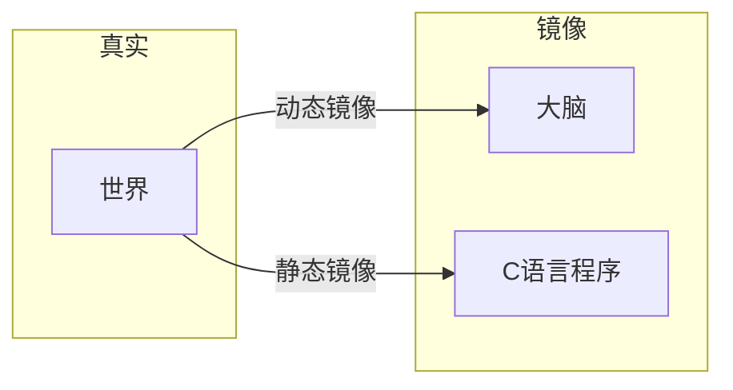
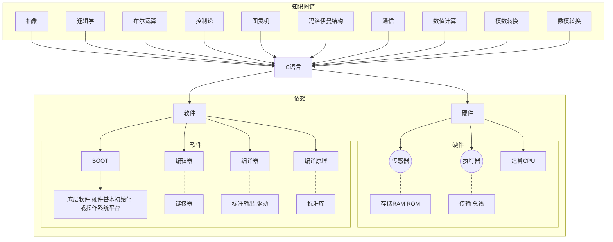
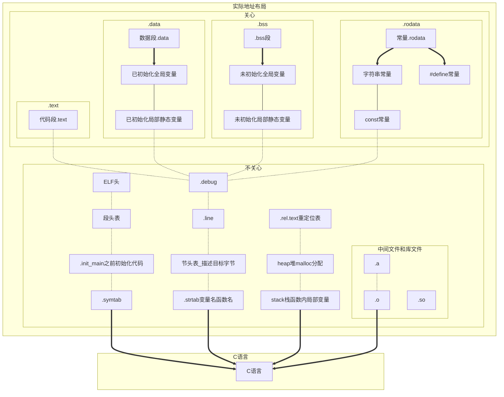
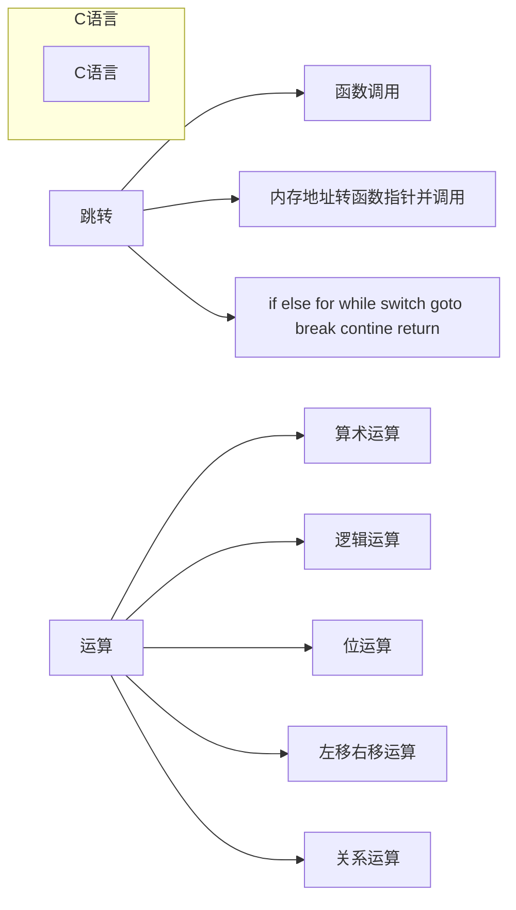

# C语言框架讲解   

---

(送书)整体介绍C语言，一期视频完整介绍C语言有用知识  

|作者|将狼才鲸|
|---|---|
|日期|2021-07-17|

_注：gitee暂不支持markdown mermaid流程图显示，需要下载Typora等软件打开本.md文件才能查看流程图和框图_  
 
## 一、引出C语言  

图1 主观理解
  

图2 C语言关联事务
  

我假设人认知世界是将世界在大脑中动态的做了一个**镜像**，那么C语言程序就是将世界做了一个静态的镜像。  
**图灵机**，用机器模拟数学计算并且证明可行：动态数据 + 固定程序 + 状态和数据存储 + 顺序指针和跳转执行。  
**冯洛伊曼结构**： 指令和数据合并在一起（因此指针能调用函数，也能调用数据，也能调用寄存器，代码段和数据段本质上是一样的结构）。  

## 二、C语言功能  

图3 C语言框架——数据布局
  

_注：不同编译器生成的地址布局名称不一样，这里以gcc举例，其它编译器大同小异_  

 

图4 C语言框架——功能
  

if, else, else if, for, while, while do, do while, swith case, break, continue，goto, ,逗号运算符, ?:运算符本质上都是内存地址的跳转，实际上只用if和goto语句就能实现以上所有的功能；  
同理，只用汇编的JMP LJMP AJMP SJMP（51汇编）或者B BL BLX BX（ARM）指令也能实现C语言的上述功能。  

|关键字||||||||
|---|---|---|---|---|---|---|---|
|数据|char| int| long |float |double |short |void |
||signed |unsigned |volatile |enum |struct |union |const |
||auto |extern  |static |register ||||
|跳转|for |if| else| while| do| switch| case| default| break|
||continue| goto | return||||||||||
|函数| sizeof |typedef |inline|||||
|不关心 |restrict| _Bool |_Complex| _Imaginary| _Alignas| _Alignof| _Atomic|
||_Static_assert| _Noreturn| _Thread_local |_Generic||||

表1 C语言关键字
  

|编译器||||||||
|---|---|---|---|---|---|---|---|
| 常量后缀 | u/U  | l/L  | f/F  | ul/UL | lu/LU | ll/LL | llu/LLU |
| 常量前缀 | 0    | 0x   | 0b   |||||
|字节对齐|#pragma pack (n)| #pragma pack () |__attribute__ ((aligned (n))) |__attribute__ ((packed))||||
|字符串宏|\_\_DATE\_\_| \_\_TIME\_\_ |\_\_func\_\_ |\_\_LINE\_\_|\_\_FILE\_\_|\_\_cplusplus|\_\_FUNCTION\_\_|

表2 编译器关键字

另：字节对齐对结构体和硬件寄存器尤其重要  

另：\_\_DATE\_\_  \_\_TIME\_\_  \_\_func\_\_  \_\_LINE\_\_  \_\_FILE\_\_  \_\_cplusplus  \_\_FUNCTION\_\_在debug调试输出log时非常有用，能准确知道程序在哪个文件的哪个函数的哪一行出错  
 
|运算符及优先级||
|---|---|
|范围限定及单目|()括号和强制转换 [] -> . !非 ~反 ++ -- +正 -负 *取值 &取址|
|算数运算|*乘 /除 %余 +加 -减 |
|整体运算|<<左移 >>右移|
|判断运算 |<小于 >大于 <=小于等于 >=大于等于 ==等于 !=不等于|
|位运算 |&按位与 ^按位异或 \|按位或|
|逻辑运算 |&&与 或|
|条件运算| ?:问号冒号运算符 ,逗号运算符 （这两个都经常用，可以缩小代码量，让代码更清晰）|
|赋值| = += \-+ *= /+ %= &= \|= \<\<= \>\>= ^= |

快捷优先级记忆：算数整体判断位逻辑，操作符多的时候尽量用括号括起来

另：左移右移也是乘2和除2，遇到乘2除2时应该用左移右移代替，提高运算速度

另：运算符生效顺序有些是由右往左，有些是由左往右，需要记忆
[运算符优先级](https://baike.baidu.com/item/%E8%BF%90%E7%AE%97%E7%AC%A6%E4%BC%98%E5%85%88%E7%BA%A7)  

## C语言与高级语言的异同  
- 当前计算机是冯洛伊曼结构或其改进结构，即指令和数据合并在一起，所以指针能调用函数也能调用数据也能调用寄存器；因为指令地址、数据地址、寄存器地址本质上是一样的东西，所以理论上通过指针可以跳转到代码中的任何位置，访问任何数据；同样的也能修改任何全局变量，修改任何内存，控制任何硬件。  
- 所以，如果不想清楚后再写C语言程序的话，经常会遇到运行时程序崩溃的情况。  
- C语言通过结构体、指针（以及指针组成的链表）、指针函数，可以实现高级语言类Class的功能
- 语言将一个模块所有全局变量都挪到结构体内，通过结构体和函数指针调用其它模块，通过void \*指针转换其它结构体数据，可以实现继承、派生等功能。  
- C语言用goto实现异常处理和资源销毁。  
 
- 高级语言自带类Class，一个类就类似于C语言中一个模块，而且一般都是类型安全、内存安全、权限安全、有异常处理。  
 
- 虽然计算机原理是由控制器、运算器、存储器、输入设备、输出设备组成的，但是其实以上任何一项内容里也可以继续包含子系统，比如键盘和鼠标里有51芯片，硬盘里有主控芯片，显示屏里也有显示芯片，有显卡，CPU有一二三级缓存、有总线。

使用sizeof等从结构体子项目指针地址获取到上级元素地址或者主结构体地址  
宏定义函数
内联函数，没有自己的栈，节省内存空间
标准库
字符串
文件
网络

大家好，我是将狼才鲸，这一期讲一讲C语言整体知识  

使用的资料是《C语言程序设计：现代方法》这本书，关于为什么选这本书不选谭浩强的C语言教材，在视频的最后再说。  

历史 优缺点 编译和链接 集成开发环境 指令 函数 语句 注释 变量 类型 声明 赋值 初始化
表达式 输入 常量的名字 标识符 书写规范 格式化输入/输出 printf函数 转换说明（默认转换）
转义序列 scanf函数
算术运算符 赋值运算符 简单赋值 左值 复合赋值 自增运算符和自减运算符
表达式求值 选择语句 逻辑表达式 关系运算符 判等运算符 逻辑运算符
if语句 复合语句 else子句 级联式if语句 条件表达式 C89中的布尔值 C99中的布尔值
switch语句 循环 while语句 do语句 for语句 在for语句中省略表达式 C99中的for语句 逗号运算符
退出循环 break语句 continue语句 goto语句 空语句
整数类型 C99中的整数类型 整型常量 整数溢出 浮点类型 字符类型

ASCII UTF-8 UNICODE GBK JSON XML 文件 HASH LOG KEY flat(每一行包含一个键值对) compact, csv格式存储键值对 INI windows格式存储键值对

有符号字符和无符号字符 字符处理函数  用getchar和putchar
常规算术转换 赋值过程中的转换 C99中的隐式转换 强制类型转换　114
sizeof __FUNC__ __LINE__ __DATE__ __TIME__ __func__
数组 一维数组 数组下标 数组初始化 多维数组 常量数组　132
函数定义 函数调用 函数声明 实际参数 实际参数的转换 数组型实际参数 变长数组形式参数 存储的堆栈 编译器 代码段 程序段
在数组参数声明中使用static inline #define # ## 
return语句 程序终止 递归 嵌入式要慎重使用，很容易堆栈溢出程序崩溃，嵌入式最好把内存的使用静态划分好
泛型选择 程序结构 局部变量 静态局部变量 形式参数 外部变量 用外部变量实现栈 程序块 作用域
指针 指针变量 取地址运算符和间接寻址运算符 按结构体获取首地址 取地址运算符 间接寻址运算符 指针赋值 指针作为参数 指针作为返回值 类似于微积分的微分、积分

内存地址，寄存器地址，带宽，位宽，信息论，镜像，代指
指针和数组 指针的算术运算 指针加上整数 指针减去整数 两个指针相减 指针比较 指向复合字面量的指针 指针用于数组处理 用数组名作为指针 数组型实际参数 指针作为数组名 指针和多维数组 处理多维数组的元素 处理多维数组的行 处理多维数组的列 用多维数组名作为指针 C99中的指针和变长数组 
标准库 字符串 内存 数学
字符串 字面串中的转义序列 延续字面串 如何存储字面串 字面串的操作 字面串与字符常量 字符串变量 初始化字符串变量 字符数组与字符指针 字符串的读和写 访问字符串中的字符
strcpy strlen strcat函数 strcmp 搜索字符串的结尾 \0 复制字符串 字符串数组 预处理器 预处理器的工作原理 预处理指令 宏定义 #define宏定义函数 C99 C11 C标准官网。。。。。。
简单的宏 带参数的宏 #运算符 ##运算符 宏的通用属性 \反斜杠 变量都用()圆括号包住，否则有bug
宏定义中的圆括号 创建较长的宏 预定义宏 C99中新增的预定义宏 空的宏参数
参数个数可变的宏 函数参数的可变参数，利用了堆栈和指针的原理来实现的 argc argv
__func__标识符 条件编译 #error多个平台多个配置时防止应用出错 
#if指令和#endif指令 defined运算符 #ifdef指令和#ifndef指令 #elif指令和#else指令
当成脚本来使用 __开头和__结尾的命名方法和编译器有关系
使用条件编译 其他指令 #error指令 #line指令 #pragma指令 _Pragma运算符
编写大型程序 源文件 头文件 #include指令 模块概念 类概念 分层概念 尽量单向调用概念

共享宏定义和类型定义 共享函数原型  共享变量声明 嵌套包含 保护头文件 头文件中的#error指令　#ifndef #define #endif
把程序划分成多个文件 构建多文件程序 makefile keil visualStudio qt qmake cmake automake

链接期间的错误 重新构建程序 在程序外定义宏 在工程中定义宏 定义pc编译器 定义交叉编译器
结构、联合和枚举 结构变量 结构变量的声明 结构变量的初始化 指示器 对结构的操作 结构类型 结构标记的声明 结构类型的定义 结构作为参数和返回值 复合字面量 匿名结构 嵌套的数组和结构
嵌套的结构 结构数组 结构数组的初始化 联合 硬件寄存器
用联合来节省空间 同时操作一个硬件寄存器和硬件寄存器中一个位 或者操作整个标志和标志中一个位 用联合来构造混合的数据结构 为联合添加“标记字段” 匿名联合
枚举 枚举标记和类型名 枚举作为整数 用枚举声明“标记字段”
指针的高级应用 动态存储分配 内存分配函数 空指针 动态分配字符串
使用malloc函数为字符串分配内存 在字符串函数中使用动态存储分配 动态分配字符串的数组 动态分配数组 calloc函数 realloc函数 释放存储空间 free函数 “悬空指针”问题 运行时报错
链表 声明结点类型 数据结构 数组 多维数组 链表 单向链表 双向链表 表 图 算法 动态菜单 ui菜单 json xml处理
创建结点  -&gt;运算符 在链表的开始处插入结点 搜索链表 从链表中删除结点 有序链表
指向指针的指针 指向函数的指针 函数指针作为参数
qsort函数 函数指针的其他用途 受限指针 弹性数组成员
声明 extern打破层级结构 理论上可以形成无限复杂的结构，因为硬件上的函数调用就是跳到指定位置，学过汇编就知道，理论上跳到哪里都可以，所以可以跳到任何地方，又从任何地方跳回来

声明的语法 存储类型 变量的性质 auto存储类型 static存储类型 extern存储类型 register存储类型　 类型限定符 声明符 解释复杂声明 使用类型定义来简化声明　369
初始化器 内联函数 内联定义 对内联函数的限制 在GCC中使用内联函数　372
函数指定符_Noreturn和头stdnoreturn.h静态断言
程序设计 模块 内聚性与耦合性 mvc
模块的类型 信息隐藏 抽象数据类型 封装 不完整类型 栈抽象数据类型 为栈抽象数据类型定义接口　 用定长数组实现栈抽象数据类型 改变栈抽象数据类型中数据项的类型 用动态数组实现栈抽象数据类型 用链表实现栈抽象数据类型 抽象数据类型的设计问题 命名惯例 小写下划线命名 驼峰命令 混合命名 默认名称 缩写名称 2 4
错误处理 通用抽象数据类型  新语言中的抽象数据类型

大量数据节省存储空间 硬件操作必须
底层程序设计 位运算符 移位运算符 按位取反运算符、按位与运算符、按位异或运算符和按位或运算符 用位运算符访问位 用位运算符访问位域 结构中的位域
其他底层技术 定义依赖机器的类型 用联合来提供数据的多个视角 将指针作为地址使用 volatile类型限定符 对象的对齐 align
对齐运算符_Alignof 对齐指定符_Alignas和头stdalign.h
标准库

c语言标准由iso官网下载，而且下载要钱
[ISO/IEC 9899:2018 Information technology — Programming languages — C](https://www.iso.org/standard/74528.html)  
下一个版本的C2x标准，预计将于2022年12月1日完成
c标准库glibc [The GNU C Library (glibc) 源码](http://www.gnu.org/software/libc/)
[The GNU C Library 使用手册](https://www.gnu.org/software/libc/manual/html_mono/libc.html)
不同编译器的标准库头文件数目不一样
[C语言标准库 中文解析](http://c.biancheng.net/cpp/u/biaozhunku/)  

标准库的使用 对标准库中所用名字的限制 使用宏隐藏的函数 stddef.h stdbool.h stdalign.h stdnoreturn.h 
输入/输出 流 文件指针 标准流和重定向 文本文件与二进制文件 文件操作 打开文件 模式 关闭文件　文件系统 fat32 ext ... 对flash 硬盘 rom等管理
为打开的流附加文件 从命令行获取文件名 临时文件 文件缓冲
检测文件末尾和错误条件 字符的输入/输出 行的输入/输出 块的输入/输出 文件定位 
库对数值和字符数据的支持 数学计算 三角函数 双曲函数 指数函数和对数函数 幂函数 就近舍入函数、绝对值函数和取余函数 数学计算 矩阵，快速傅里叶变换，算法，通信 复数
IEEE浮点标准 类型 宏 分类宏 三角函数 双曲函数 指数函数和对数函数 函数和绝对值函数 误差函数和伽马函数 就近舍入函数  取余函数 操作函数 最大值函数、最小值函数和正差函数 浮点乘加 比较宏 ctype.h 字符处理 字符分类函数 字符大小写映射函数 
string.h 字符串处理 复制函数 拼接函数  比较函数 搜索函数 其他函数
assert.h 诊断 errno.h signal.h 信号处理 信号宏 signal函数 预定义的信号处理函数 raise函数 setjmp.h 非局部跳转 国际化特性 locale.h 本地化 setlocale函数 localeconv函数 
多字节字符和宽字符 utf-8 unicode gbk
多字节字符 宽字符 Unicode和通用字符集 Unicode编码 多字节/宽字符转换函数 多字节/宽字符串转换函数 双联符和三联符 三联符 双联符 iso646.h 拼写替换 通用字符名 wchar.h 扩展的多字节和宽字符实用工具 流的倾向性 格式化宽字符输入/输出函数 宽字符输入/输出函数 通用的宽字符串实用工具 宽字符时间转换函数 扩展的多字节/宽字符转换实用工具 wctype.h 宽字符分类和映射实用工具　 宽字符分类函数 可扩展的宽字符分类函数 宽字符大小写映射函数  可扩展的宽字符大小写映射函数 uchar.h 改进的Unicode支持  带u、U和u8前缀的字面串 可重启动的多字节/宽字符转换函数
u u8 L ul 0
stdarg.h 可变参数 调用带有可变参数列表的函数 v…printf函数 v…scanf函数 stdlib.h 通用的实用工具 数值转换函数 伪随机序列生成函数 与环境的通信 搜索和排序实用工具 整数算术运算函数 地址对齐的内存分配 time.h 日期和时间 时间处理函数 时间转换函数
嵌 
stdint.h 整数类型 stdint.h类型inttypes.h 复数 复数的算术运算 复数算术运算 complex.h CX_LIMITED_RANGE编译提示 complex.h  三角函数 双曲函数 指数函数和对数函数 幂函数和绝对值函数 gmath.h 泛型宏 调用泛型宏 fenv.h 浮点环境 浮点状态标志和控制模式 fenv.h 宏 FENV_ACCESS编译提示 浮点异常函数 舍入函数 C1X新增的多线程和原子操作支持 threads.h 多线程执行支持 线程启动函数 线程的创建和管理函数 数据竞争 互斥函数 条件变量 条件变量函数 递归锁和非递归锁 初始化函数  _Thread_local 存储类和线程存储期 线程专属存储 线程专属存储函数  _Atomic stdatomic.h 原子类型和原子操作支持　 _Atomic：类型指定符/类型限定符  标准库定义的原子类型　  初始化原子变量　 原子变量的初始化函数  原子操作　 原子操作函数  内存顺序  围栏函数  锁无关判断函数 原子标志类型及其操作函数　 

书写规范

《C语言程序设计：现代方法》这边书售价一百多块，看到这里的朋友只要给我投币，并在这个视频的弹幕里面留下书名，我就抽8个同学送出这本书。这本书是美国人写的，国内翻译的，之所以选它作为参考是因为书质量好，豆瓣评分9.4分，书中也没有错误，最重要是代码编写规范很好，提供的源码注释、命名、编码都很规范；而谭浩强的书里面代码的编写不规范，代码格式不好，有些还是在工作中要避免的写法，对空格、换行、命名这些处理不好。  