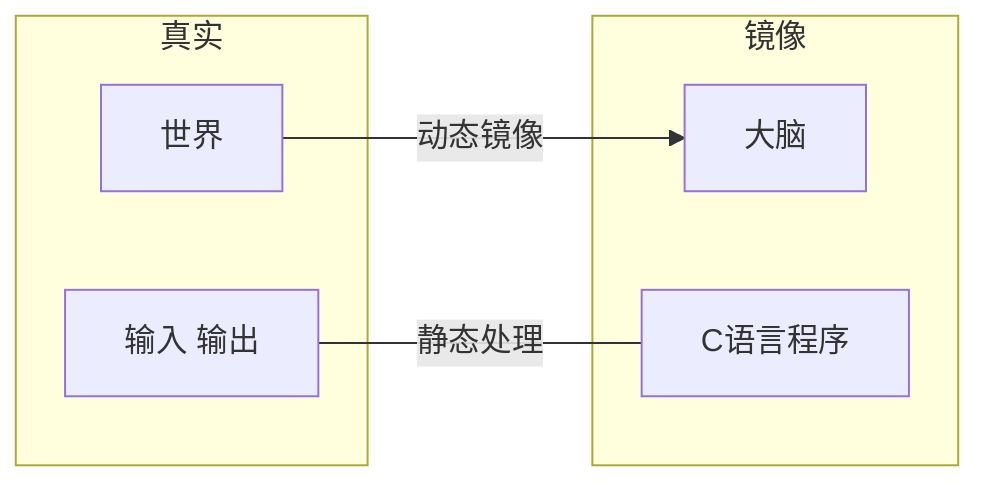
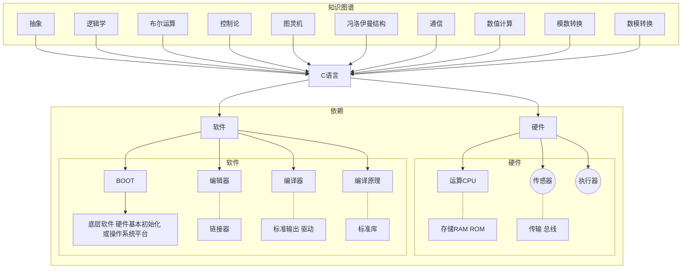
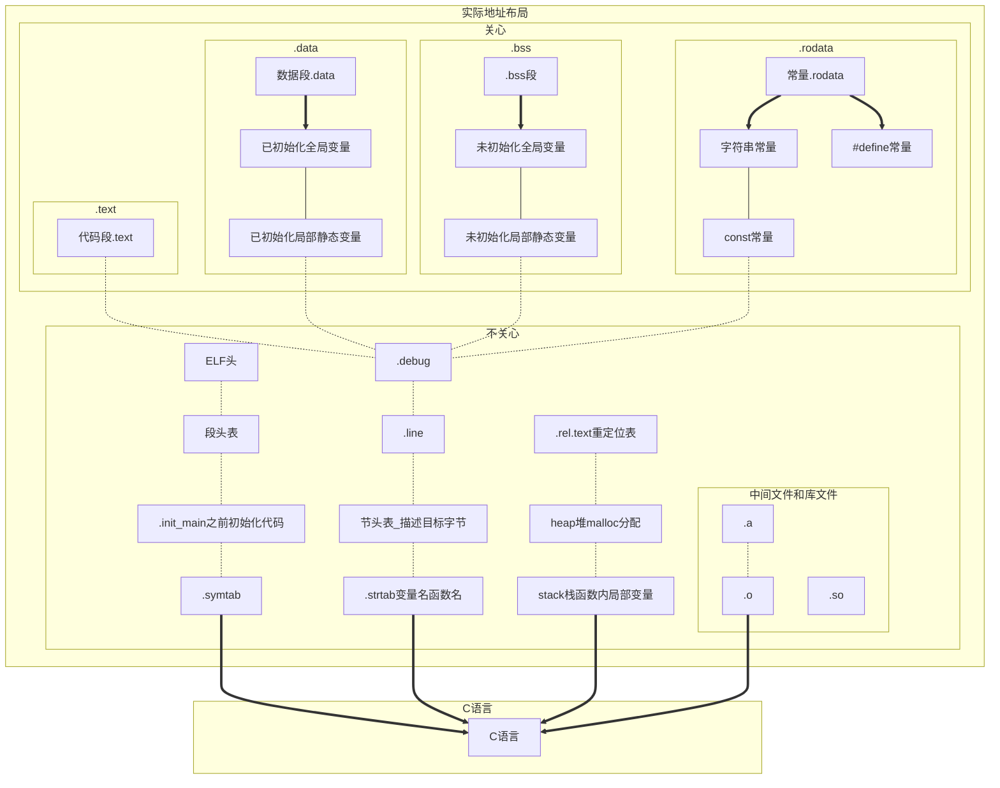
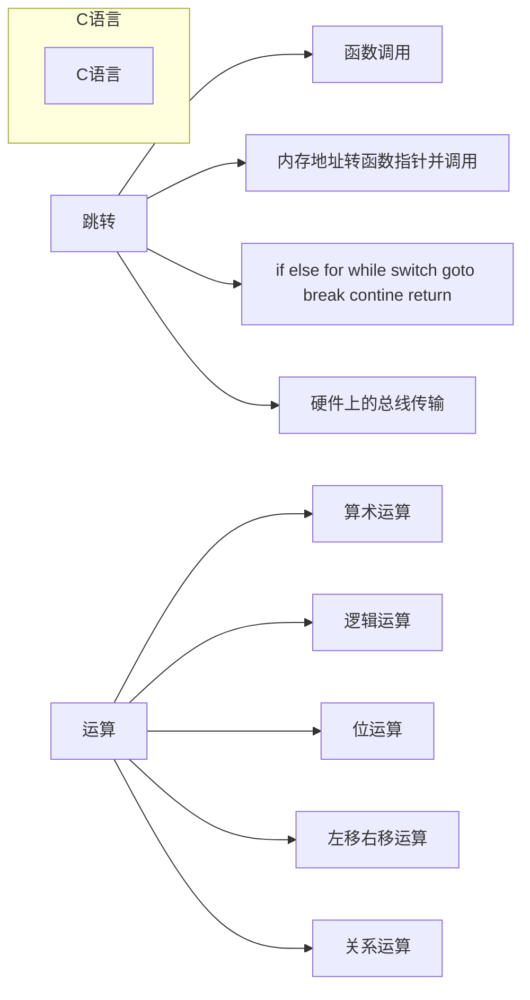
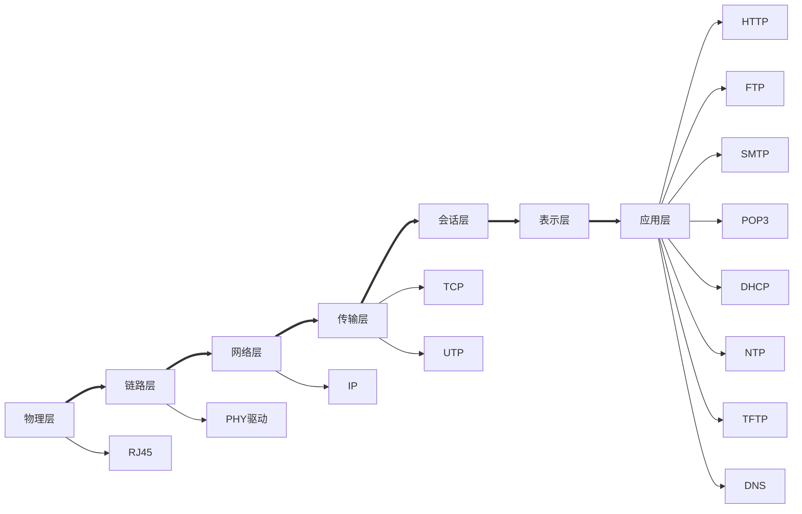

# C语言框架讲解   

---

[b站配套视频地址](https://space.bilibili.com/106424039)  

|作者|将狼才鲸|
|---|---|
|日期|2021-07-17|

_注：gitee暂不支持markdown mermaid流程图显示，需要下载Typora等软件打开本.md文件才能查看流程图和框图_  
<br>

## 一、引出C语言  

<center>图1 主观理解</center>  


<center>图2 C语言关联事务</center>  



我假设人认知世界是将世界在大脑中动态的做了一个**镜像**，那么C语言程序就是将世界的信息做一个静态的处理，或者将处理的信息送出外界。  
**图灵机**，用机器模拟数学计算并且证明可行：动态数据 + 固定程序 + 状态和数据存储 + 顺序指针和跳转执行。  
**冯洛伊曼结构**： 指令和数据合并在一起（因此指针能调用函数，也能调用数据，也能调用寄存器，代码段和数据段本质上是一样的结构）。  

## 二、C语言功能  

<center>图3 C语言框架——数据布局</center>  



_注：不同编译器生成的地址布局名称不一样，这里以gcc举例，其它编译器大同小异_  

<br>

<center>图4 C语言框架——功能</center>  



if, else, else if, for, while, while do, do while, swith case, break, continue，goto, ,逗号运算符, ?:运算符本质上都是内存地址的跳转，实际上只用if和goto语句就能实现以上所有的功能；  
同理，只用汇编的JMP LJMP AJMP SJMP（51汇编）或者B BL BLX BX（ARM）指令也能实现C语言的上述功能。  

|关键字||||||||
|---|---|---|---|---|---|---|---|
|数据|char| int| long |float |double |short |void |
||signed |unsigned |volatile |enum |struct |union |const |
||auto |extern  |static |register ||||
|跳转|for |if| else| while| do| switch| case| default| break|
||continue| goto | return||||||||||
|函数| sizeof |typedef |inline|||||
|不关心 |restrict| _Bool |_Complex| _Imaginary| _Alignas| _Alignof| _Atomic|
||_Static_assert| _Noreturn| _Thread_local |_Generic||||

<center>表1 C语言关键字</center>  

|编译器||||||||
|---|---|---|---|---|---|---|---|
| 常量后缀 | u/U | l/L  | f/F  | ul/UL | lu/LU | ll/LL | llu/LLU |
| 常量前缀 | 0    | 0x   | 0b   |L宽字节中文字符串||||
|字节对齐|#pragma pack (n)| #pragma pack () |__attribute__ ((aligned (n))) |__attribute__ ((packed))|多用于硬件寄存器结构体|和通讯数据结构体正确操作数据|因为一般OS都会默认四字节或两字节补齐|
|字符串宏|\_\_DATE\_\_| \_\_TIME\_\_ |\_\_func\_\_ |\_\_LINE\_\_|\_\_FILE\_\_|\_\_cplusplus|\_\_FUNCTION\_\_|

<center>表2 编译器关键字</center>  

另：字节对齐对结构体和硬件寄存器尤其重要  

另：\_\_DATE\_\_  \_\_TIME\_\_  \_\_func\_\_  \_\_LINE\_\_  \_\_FILE\_\_  \_\_cplusplus  \_\_FUNCTION\_\_在debug调试输出log时非常有用，能准确知道程序在哪个文件的哪个函数的哪一行出错  
<br>

|运算符及优先级||
|---|---|
|范围限定及单目|()括号和强制转换 [] -> . !非 ~反 ++ -- +正 -负 *取值 &取址|
|算术运算|\*乘 /除 %余 +加 \-减 |
|整体运算|<<左移 >>右移|
|判断运算 |<小于 >大于 <=小于等于 >=大于等于 ==等于 !=不等于|
|位运算 |&按位与 ^按位异或 \|按位或|
|逻辑运算 |&&与 或\|\||
|条件运算| ?:问号冒号运算符 ,逗号运算符 （这两个都经常用，可以缩小代码量，让代码更清晰）|
|赋值| = += \-+ *= /+ %= &= \|= \<\<= \>\>= ^= |

<center>表3 运算符和优先级</center>  

快捷优先级记忆：算数整体判断位逻辑，操作符多的时候尽量用括号括起来  

另：左移右移也是乘2和除2，遇到乘2除2时应该用左移右移代替，提高运算速度  

另：运算符生效顺序有些是由右往左，有些是由左往右，需要记忆  
[运算符优先级](https://baike.baidu.com/item/%E8%BF%90%E7%AE%97%E7%AC%A6%E4%BC%98%E5%85%88%E7%BA%A7)  

## 三、C语言与高级语言的异同  

- 当前计算机是冯洛伊曼结构或其改进结构，即指令和数据合并在一起，所以指针能调用函数也能调用数据也能调用寄存器；因为**指令**地址、**数据**地址、**寄存器**地址**本质上是一样**的东西，所以理论上通过指针可以跳转到代码中的任何位置，访问任何数据；同样的也能修改任何全局变量，修改任何内存，控制任何硬件。  
- 所以，如果不想清楚后再写C语言程序的话，特别是还使用指针和内存分配动态分配的情况，经常会遇到运行时程序崩溃的情况。  
- C语言可以通过结构体、指针（以及指针组成的链表）、指针函数，可以实现高级语言类Class的功能，大型的程序如Linux kernel、ffmpeg、QEMU等都整体使用这种特性。  
- 语言将一个模块所有全局变量都挪到结构体内，通过结构体和函数指针调用其它模块，通过void \*指针转换其它结构体数据，可以实现继承、派生等功能。  
- C语言可以用goto实现异常处理和资源销毁。  
<br>
- 高级语言自带类Class，一个类就类似于C语言中一个模块，而且一般都是类型安全、内存安全、权限安全的，有异常处理手段。  
<br>
- 虽然计算机原理是由控制器、运算器、存储器、输入设备、输出设备组成的，但是其实以上任何一项内容里也可以继续包含子系统，比如键盘和鼠标里有51芯片，硬盘里有主控芯片，显示屏里也有显示芯片，有显卡，CPU有一二三级缓存、有总线。  

## 四、C语言模块  

### 1. 标准库  
- 编译器提供代码事先初始化一部分硬件，如CPU、内存、分频倍频、串口的对接，这部分代码放在.init段（上电时从ROM搬运到RAM），并且在main()函数之前执行；或者启动操作系统的一个窗口（控制台），重定向标准输入输出流到此控制台。  
- 编译器还提供了一些常用的函数，即C语言标准程序库，使用到了哪些函数，生成程序时就把此部分机器码放到可执行文件中（链接）。  

<br>

- 常用的头文件（模块）如stdio.h、string.h、stdlib.h。  
- 常用的函数如printf()、scanf()。  

<br>

C语言标准由iso官网下载，而且下载要钱，当前版本2018  
[ISO/IEC 9899:2018 Information technology — Programming languages — C](https://www.iso.org/standard/74528.html)  
下一个版本的C2x标准，预计将于2022年12月1日完成  
C标准库glibc [The GNU C Library (glibc) 源码](http://www.gnu.org/software/libc/)  
[The GNU C Library 使用手册](https://www.gnu.org/software/libc/manual/html_mono/libc.html)  
不同编译器的标准库头文件数目不一样
[C语言标准库 中文解析](http://c.biancheng.net/cpp/u/biaozhunku/)  

- 嵌入式编译器对glibc中的内容可能并不完全实现，只实现常用的那部分，如stdio.h string.h stdlib.h ，像time.h可能就用不了，因为有些嵌入式设备都没有RTC，或者除了tick时钟滴答（主频的循环计数）不需要时分秒，而且不同月份天数、闰年闰月的计算也会增大可执行文件的大小。  

### 2. 输入、输出、输出级别、日志  
- 输入输出的常用接口是printf()、scanf()，一般是默认重定向到console，如串口或者控制台，但是也可以在编译器中将输入输出重定向到其它位置，比如debug时的IDE窗口、文件、其它串口等。  
- 输入输出支持多个数据与字符串之间的转换（控制符）和转移字符，如：  

|%s| %c| %d| %f| %ld长整型| %lld| %u无符号| %.md限制小数点位数的浮点数 |
|---|---|---|---|---|---|---|---|
|%x %X十六进制（小写 大写）| %08x定长八个字符十六进制|%#x %#X带0x开头|\t tab制表|\r换行|\r\n回车换行|其它\a \b \f \v \\' \\" \\\\|%p|

<center>表4 控制符和转义字符</center>  

- 对printf进行封装形成带级别的输出函数，如pr_info() pr_debug() pr_warnning() pr_detail()，在系统设置了可输出的宏级别后，只允许达到级别的输出生效；也可以使用pr(INFO, "out string.\n");类似的形式。  
- 在printf()输出信息时可以携带编译器提供的字符串，如文件名、函数名、文件行数、编译时的时间（这些信息可以在自己封装的函数如pr_info()调用时自动添加上，不用每条语句都手动写），如：  

```c
#include <stdio.h>

int main()
{
	#define LINEFEED "\n" // "\r\n"

	printf("[INFO] " "build time:%s %s" "%s", __DATE__, __TIME__, LINEFEED);
	printf("[ERROR]" "[locate:%s %s() line:%d] " "%s" "%s",
           __FILE__, __func__, __LINE__, "process error!", LINEFEED);

	return 0;
}
// 输出信息：
// [INFO] build time:Jul 17 2021 16:20:42
// [ERROR][locate:main.c main() line:8] process error!

```

这时候如果程序出错，调试时不需要使用仿真器（调试器），直接看输出log信息就能看到程序在哪里出错。  

[高级输出级别控制 示例代码](https://gitee.com/langcai1943/embedded_programming_skills/blob/develop/1_src/02-print_control/print_ctrl.h)  

#### 2.1 字符串、编码格式  

- 计算机除了计算，主要就是处理信息，那么对信息的定义就尤其重要，数据的类型如整型、浮点型等后面再说，本章节只说文件（字符串）编码格式，格式有：  

| ASCII                            | Unicode                     | GB2312                      | UTF-8                |
| -------------------------------- | --------------------------- | --------------------------- | -------------------- |
| 128个有效字符不含中文、C语言默认 | QT、VisualStudo、JAVA等默认 | 国标、节省空间、Windows默认 | Linux默认、iOS默认   |
|                                  | \r                          | \r\n                        | \n                   |
|                                  | 苹果iOS换行符               | Windows换行符               | Linux/嵌入式换换行符 |

<center>表5 文件格式和换行格式</center>  

- 操作系统提供文件系统，如果裸机就需要拷贝开源文件系统模块到自己的源码工程中，还需要提供Flash等存储器驱动。  
- 相关的内容还有国际化和本地化。  
- 字符串中使用中文需要使用宽字符，wchar_t str = L"中文字符串"; 是将字符串强制转换成固定两字节的Unicode格式，如下：  

```c
#include <wchar.h>
#include <wctype.h>
wchar_t str = L"中文字符串"; // 具体使用的wchar_t等关键字依赖于编译器或操作系统
```

- 对中文的支持与各编译器相关，请与当前使用的操作系统和编译器为准。  

- 当你需要对通讯链路上的数据进行操作，解析JSON、XML、ini等配置文件时，就不得不进行字符串的复杂操作，你需要掌握字符串查找、字符串拼接、字符串分割、字符串转整型、字符串转浮点型等技能。  
- 你可以直接用指针操作字符串，类似于这样：  

```c
#include <stdio.h>

#define MAX_LEN 64

char *in_data = "head,cmd:01,data:Open_machine,end"; // 控制字符串，以,逗号和冒号进行分割
//char *in_data[] = {0xAA, 0xBB, 0x03, 0x01, 0x55, 0x55, 0xCC, 0xDD}; // 包头AABB，包长03，命令码01，数据5555，包尾CCDD
char tmp[MAX_LEN];
char tmp2[MAX_LEN];

/* 找到控制字符串data下的数据Open machine */
int main()
{
	int i;
	char *indata = in_data;
	char *item;
	char *cmd;

	while (*indata != '\0') { // 如果文件未达到结尾则一直循环
		item = tmp;
		while (*indata != ',' && *indata != '\0') { // 分割控制字符串
			*item = *indata;
			item++;
			indata++;
		}
		*item = '\0'; // 手动设置字符串结尾

		item = tmp; // 将指针重新定位到字符串开始位置
		cmd = tmp2;
		while (*item != ':' && *item != '\0') {
			*cmd = *item;
			cmd++;
			item++;
		}
		*cmd = '\0';

		cmd = tmp2;
		printf("cmd-%s-\n", cmd);
		if (cmd == "data") { // 找到命令码
			printf("找到了data命令\n");
			item++; // 跳过:冒号
			while (*item != '\0') {
				*cmd = *item; // 重新利用cmd缓存，存储命令数据
				cmd++;
				item++;
			}
			cmd = tmp2;
			printf("找到了Open_machine数据\n");
			printf("=%s=\n", cmd);
		}
		indata++;
	}
}
// 由此可见，由自己实现字符串的操作比较复杂，而且重用性不好，所以推荐掌握好strstr, strncpy, strcat, strcmp, strlen等系统函数
```

- 字符串和整型、浮点型等相互转换的系统函数为**atoi()，itoa()， atof()， ftoa()，**如果是嵌入式编译器对其中有些函数不支持，则上网抄该函数实现的源码。  
- 其它很有用的操作：vsprintf()用printf参数的方式把字符串输出到开辟的内存或数组中，vsnprintf()，vprintf()  

#### 2.2 文件操作  

- 文件操作涉及到文件系统和对Flash、硬盘等ROM的驱动管理。  
- 文件系统，表格如下：  

|Windows|Linux|iOS|嵌入式|
|---|---|---|---|
|FAT32 FAT16 NTFS|EXT EXT2 EXT3 EXT4 XFS|HFS UFS APFS|Ramfs JFFS2 VAFFS ROMFS Ramdisk|

<center>表6 文件系统格式</center>  

- Ramfs用户空间是映射到内存的，用户修改了文件之后，断电重启文件又会恢复。因为嵌入式程序的权限很大，这样改错了文件也不至于让设备成为板砖。  
- Windows、Linux、iOS的文件系统更适合硬盘等设备，也可以用在嵌入式中，让嵌入式设备支持；但嵌入式设备的文件系统更适合Flash等ROM，性能、空间消耗更小。  
- 很多嵌入式设备尤其是单片机，根本就没有文件系统，对数据的读取都是直接读Flash。  

- 文件操作，如二进制文件，文本文件，文件操作：打开、定位、修改、替换、覆盖、新建、保存等。  
- C语言直接使用<stdio.h>中的文件操作函数即可，如FILE *fopen(char *filename, char *mode);  

|结构体和宏|size_t|FILE文件指针|EOF文件结尾|SEEK_CUR当前位置|SEEK_END文件末尾|SEEK_SET文件开头|……|
|---|---|---|---|---|---|---|---|
|文件操作|fopen|fwrite|fread|rewind跳到文件开头|ftell获取文件长度|fseek跳转到指定位置|fclose|
||fflush保存文件前先把已写入但是还在缓存中的数据同步到存储介质中去|……||||||
|open时标志|r只读|r+读写|rb+读写二进制|w只写|w+新建且可读写|wb|rw等|

<center>表7 文件操作</center>  

- 具体的文件操作还是要自己写几个demo，实际跑一下才能弄清楚。  
- 非常有用的文件格式有JSON、XML、INI等文件，不管是存储数据，获取配置都很有用，需要掌握。这些文件都涉及到字符串**键值对**，和键值对的嵌套，对这些文件的增删改查操作用到了结构体+指针链表+递归，但是有解析这些文件的开源项目，可以直接抄到自己的代码工程中。  

### 3. 书写规范  

- 命名、空格、括号位置、注释，详见：  
[C语言编码规范和注释规范详解](https://gitee.com/langcai1943/embedded_programming_skills/blob/develop/1_src/01-c_comments/main.c)  
- 命名惯例有几种方式：小写+下划线命名、大驼峰命名、小驼峰命名、匈牙利命名、混合命名。  
-错误码、错误提示字符串，详见<errno.h>（如果是嵌入式编译器需要自行实现），详见：  
[C语言错误码](https://gitee.com/langcai1943/embedded_programming_skills/blob/develop/1_src/07-error_no/errno.h)  

### 4. 多线程、同步竞争、操作系统  

- 线程的操作和同步竞争机制，不同的操作系统使用方法不一样，但是基本概念一样，这里以Linux举例。  

```c
#include <pthread.h> // 线程、互斥、条件变量
#include <semaphore.h> // 信号量

```

|pthread_create()创建|pthread_exit()终止|pthread_join()等待|pthread_cancel()|pthread_kill()|
|---|---|---|---|---|
|pthread_mutex_t互斥锁|pthread_cond_t条件变量||||

- 其它：死锁、原子操作、PV操作、信号量、自旋锁、邮箱、管道  
- 因为线程和同步竞争涉及到操作系统原理的背景知识，需要知道编码时对竞争现象的避免，优先级反转，流水线等基础知识，这里不过深入介绍，需要自行多写demo进行练习。  

### 5. 运算、算法  

- 数学库<math.h>  
- 数学库运算函数：三角函数、双曲函数、指数函数、对数函数、幂函数、就近舍入函数、绝对值函数、取余函数、误差函数、伽马函数、最大值函数、最小值函数、正差函数、qsort函数 。  
- 数学计算：矩阵，快速傅里叶变换，复数，多用于算法、通讯计算。  
- malloc/realloc/free动态存储分配、指针、利用内存进行多中算法计算。  
- 数据结构：数组、多维数组、链表、单向链表、双向链表、表、图。  
- 链表可以用来实现**循环缓存**、console菜单、UI菜单、JSON文件解析、XML文件解析、实现面向对象。对写应用来说链表非常重要。  
- 链表的创建、链表插入结点、搜索链表、从链表中删除结点、有序链表。  
- 指针的嵌套：指向指针的指针、指向函数的指针、受限指针、弹性数组成员。  
- 指针再配合extern声明打破层级结构，理论上可以形成无限复杂的结构，因为硬件上的函数调用就是跳到指定位置，学过汇编就知道，理论上跳到哪里都可以，所以可以跳到任何地方，又从任何地方跳回来。  
<br>

- 有符号字符、无符号字符 、常规算术转换、赋值过程中的转换、隐式转换、强制类型转换。类型转换也是导致C语言程序经常出错的原因。  
- stdint.h整数类型，inttypes.h数值兼容，complex.h复数算术运算、gmath.h、fenv.h。  

### 6. 函数、模块、结构体  

#### 6.1 函数可变参数  

- C 语言中最常用的可变参数函数例子是 printf()、scanf()、Linux应用程序的调用（如ls -l命令），用处还是很广，实现的原理是利用函数参数是存放在栈中，是连续存放的，利用地址指针的连续性和参数个数获取所有参数。main()函数也是默认携带int argc, void *argv[]参数的。  
- 实现这种特性的原理在其它地方也很有用。  

- 两种调用形式：
int main(int argc, char *argv[]) {}  
void func(int argc, ...) {}  

```c
/* 简单使用 */
#include <stdio.h>

int main(int argc, char *argv[])
{
	printf("参数个数：%d\n", argc);
    printf("程序路径和程序名：%s\n", argv[0]);

    /* 读取参数 */
    for (int i = 0; i < argc; i++) {
    	printf("参数%d：%s\n", i, argv[i]);
    }

    return 0;
}
/* 运行结果
$ ./demo.exe 中国 China china bilibili
参数个数：5
程序路径和程序名：C:\Users\jim\Desktop\demo.exe
参数0：C:\Users\jim\Desktop\demo.exe
参数1：?й?
参数2：China
参数3：china
参数4：bilibili
*/
```

```c
/* 高级使用 */
#include <stdio.h>
#include <stdarg.h>

/* 无法直接确定可变参数的个数，可以用一个int参数或者char *format参数传入值然后读出或者解析出参数个数，并且每个参数的类型也要自行约定好 */
void func(int argc, float param2, char * param3, ...)
{
	va_list arg;
	va_start(arg, param3);

	printf("固定参数1（约定为可变参数的个数）：%d\n", argc);
	printf("固定参数2：%f\n", param2);
	printf("固定参数3：%s\n", param3);

	int param4 = va_arg(arg, int); // 可变参数的前一个参数，指示可变参数开始的位置
	printf("可变参数4：%d\n", param4);
	double param5 = va_arg(arg, double); // double为约定好的类型
	printf("可变参数5：%f\n", param5);
	char *param6 = va_arg(arg, char *);
	printf("可变参数6：%s\n", param6);

	va_end(arg);
}
 
int main(int argc, char **argv)
{
	func(3, 2.2, "CCC", 4, 5.5, "ff");

	return 0;
}
/*
执行结果：
$ ./demo.exe
固定参数1（约定为可变参数的个数）：3
固定参数2：2.200000
固定参数3：CCC
可变参数4：4
可变参数5：5.500000
可变参数6：ff
*/
```

- 起始可变变量的实现，是利用了连续的内存存储，指针、sizeof()、 offsetof()、 typeof()这些系统函数的特性实现的。  
- 利用相同的特性还可以实现利用结构体实现Class类，以及类的继承，还有通讯中数据的分层解析和传递等功能。  
- 函数的内部的对参数的处理都是**形参**，即将参数值拷贝一份依次压到栈中（所以函数参数不宜传数据量大的结构体和数组，会导致栈溢出，应该只传指针），而函数中要保证参数的修改在调用者中生效的话只能用指针。函数退出的时候会将栈释放。  
- inline内联函数，不开辟栈，没有额外内存消耗。内联函数也经常用。  
- #define(x，y, z)的形式实现的宏定义函数，只是文本替换，也没有栈的消耗。  
- 递归函数，嵌入式要慎重使用，很容易堆栈溢出程序崩溃，嵌入式最好把内存的使用固定下来，能用静态分配就不用动态分配（因为也没有多个进程随机执行）。  
<br>

- 函数内的static变量：不管函数被调用多少次，该变量只初始化一次，并且函数再次被调用时上次的值还被保留，和全局变量一样，只是作用域只在当前函数中。  

#### 6.2 模块和结构体  

- 在程序设计当中，为了更简单更有条理，引入了 **模块**的概念，C语言中模块是一个抽象的概率，只实现一个功能的一组代码就是一个模块，类似于面向对象中的**类**。  
- 模块最好能做到内聚性与耦合性，像mvc架构就是一种模块化的架构。  
- 将一组有关的数据和函数放在一起，那么就用结构体struct。  
- 结构体有一个很巧妙的用法，可以从结构体子元素的地址回溯到主结构体的地址：从元素地址倒推数据结构首地址的方法: 使用**offsetof()、typeof()、sizeof()**。可以用于解析多层结构体嵌套、结构体最后一个参数为变长参数（也叫柔性数组，可用于通讯数据的传输）、面向对象的继承。  
<br>

- 基本上，约定俗成一个C语言模块至少是一个.c源文件 + 一个.h头文件，最多是一个文件夹，文件夹里面可以有多个.c .h文件和多个文件夹。  
- 模块的一个基本概念就是，模块间尽量减少相互调用，尽量进行单向层级调用，即模块1调用模块2，模块2调用模块3，而模块3不调用模块2和模块1，如果没办法一定要调用，最好使用回调函数、或者全局函数或数据。  


```c
typedef struct { 
    char a; 
    char b[0]; // 这就是一个不知道长度，也不知道类型的，在内存中连续存储的变长数据
}; 
```

- 模块.h头文件中会用extern关键字声明本模块暴露出的函数和数据，如：

```c
// api_data.h
struct api_data_t {
	int a;
	int (*func)(void);
};
extren struct api_data_t api_data;
extern int api_func1(void);
extren int api_func2(struct api_data_t *data);
```

- 你可以在.c文件中直接使用extern声明后调用任何模块中的函数和数据，而不用包含头文件！当你开发过程中，只是为了测试，不考虑模块结构被破环的情况下可以随意使用。
- 如：模块1包含模块2，模块2包含模块3，那么模块3就不能包含模块1，那么模块3要使用模块1的函数，在测试阶段可以这样：module1.c中#include "module2.h"，module2.c中#include "module3.h"，那么module3.c中不能#include"module1.h"，但是可以直接extern int module1_api(void);，然后直接使用module1_api(); 正式阶段还是要用回调函数或者公用模块  

#### 6.3  宏定义、区块控制、宏定义函数  

- 宏定义函数很好用：  
[#define宏定义函数示例代码](https://gitee.com/langcai1943/embedded_programming_skills/blob/develop/1_src/02-print_control/print_ctrl.h)  
- #井号在宏定义中将变量名转成字符串，##两个井号将两个变量名或字符串拼接成一个字符串。  
- typedef在结构体struct命名、enum命名中很使用、在函数指针定义中也很好用。  

```c
// typedef用法1
typedef struct _TMP_T {
	int a;
	void (func*)(void);
} TMP_T;
// typedef用法2
typedef void (*PFUNC)(void); // 函数指针多用于模块函数反向调用（回调函数），和模拟面向对象
// 宏定义函数用法
#define func(x, y) do {				\
						(x)++;		\
						(y) += (x);	\ // 最后一个表达式的值，即为宏函数的返回值
					} while (0)
```

- 宏定义用于头文件不递归调用：  

```c
/* func.h */
#ifndef _FUNC_H // 这是一个约定俗成的名称，也可以是_FUNC_H_
#define _FUNC_H
	/* 头文件内容 */
#endif _FUNC_H
```

- 嵌套包含，保护头文件，头文件中的#error指令，#ifndef、#define、#endif  
- 宏定义用于编译时提示有多个配置可供选择的大型程序保证配置正确  

```c
/* main.h */
#ifndef _MAIN_H
#define _MAIN_H

#ifdef DEBUG
#	warning "当前是测试版本，如果你当前正在编译发布程序，记得修改宏定义！不是则忽略此提示"
#endif

#if !defined(DEBUG) && !defined(RELEASE) && !defined(TEST)
#	error "配置错误！请定义运行环境！" // 对#error宏定义的使用
#endif

#endif _MAIN_H
```

- 宏定义中#运算符和##运算符  

```c
#include <stdio.h>

#define name2str(x) #x // #井号将函数名转成字符串
#define multi_name2str(x, y) x##y // ##两个井号将两个名字拼接成一个字符串
void func_a(void) {printf("%s", name2str(func_a));}
void func_b(void) {printf("b", name2str(func_b));}

int main()
{
	printf("函数名：%s\n", name2str(main));
	multi_name2str(func_, a)();
	/* 能调用func_a函数，可以通过a这个参数调用func_a或者func_b等不同的一组命名相似的函数，在宏定义函数中调用不同函数时尤其好用，Linux kernel中就用到了很多类似的机制 */
}
```

- 宏如果有多行，行尾要用 \反斜杠，宏定义函数变量都用()圆括号包住，否则会有bug，而且宏定义函数运行时如果出现了bug很不好定位，所以宏定义函数要行数少，充分测试好再用。  
- 编译有多个文件的程序时，根据不同的编译器，可以手动写编译用的配置文件如makefile、qmake、cmake、automake，也可以用IED集成开发环境建工程，如keil、visualStudio、qt。要学会配置编译器，如果是嵌入式还要会改main()运行之前的init配置。  

### 7. 网络、通信  

- C语言网络编程用套接字socket。  
- 背景知识：OSI七层模型（），TCP/IP。  



[OSI七层模型详解](https://blog.csdn.net/yaopeng_2005/article/details/7064869)  

- ip网段，192.168.1.1局域网地址，127.0.0.1，MAC地址，端口，常用应用服务的默认端口。  
- 常用通讯：网络、WiFi、USB、2G3G4G5G、蓝牙、2.4G  
- 嵌入式通讯：串口、I2C、I2S、SPI、CAN、 Zigbee、Modbus、MIPI ......  
- 一个socket的使用可以当成一个和串口类似的裸数据传输，只是和串口不一样的是TCP是数据安全的，使用数据时可以不用校验码。  
- TCP使用三次握手链接。  
- socket编程分为服务器端和客户端，使用的函数为：

|服务器|socket()选择TCP或UTP|bind()确定IP和端口|listen()等待客户端|accept()握手链接|write()发送数据|read()接受数据|select() pselect()非阻塞式读数据|close()|
|---|---|
|客户端|socket()|connect()使用IP和端口主动连接|write()发送数据|read()接受数据|select() pselect()非阻塞式读数据|close()|

```c
// 原始地址：http://c.biancheng.net/cpp/html/3030.html
/* socket编程 */
// 分为服务器端和客户端

/* 服务器端 */
#include <arpa/inet.h>
#include <sys/socket.h>
#include <netinet/in.h>

int main()
{
    // 创建套接字 socket
    int serv_sock = socket(AF_INET, SOCK_STREAM, IPPROTO_TCP); // 选择使用TCP还是UTP

    // 将套接字和IP、端口绑定 bind
    struct sockaddr_in serv_addr;
    memset(&serv_addr, 0, sizeof(serv_addr));  // 每个字节都用0填充
    serv_addr.sin_family = AF_INET;  // 使用IPv4地址
    serv_addr.sin_addr.s_addr = inet_addr("127.0.0.1");  // 具体的IP地址
    serv_addr.sin_port = htons(1234);  // 端口
    bind(serv_sock, (struct sockaddr*)&serv_addr, sizeof(serv_addr));

    // 进入监听状态，等待用户发起请求 listen
    listen(serv_sock, 20);
    // 接收客户端请求
    struct sockaddr_in clnt_addr;
    socklen_t clnt_addr_size = sizeof(clnt_addr);
    int clnt_sock = accept(serv_sock, (struct sockaddr*)&clnt_addr, &clnt_addr_size);
    //向客户端发送数据
    char str[] = "Hello World!";
    write(clnt_sock, str, sizeof(str));

    //关闭套接字
    close(clnt_sock);
    close(serv_sock);

	return 0;
}

/* 客户端 */
#include <arpa/inet.h>
#include <sys/socket.h>

int main(){
    //创建套接字
    int sock = socket(AF_INET, SOCK_STREAM, 0);
    //向服务器（特定的IP和端口）发起请求
    struct sockaddr_in serv_addr;
    memset(&serv_addr, 0, sizeof(serv_addr));  //每个字节都用0填充
    serv_addr.sin_family = AF_INET;  //使用IPv4地址
    serv_addr.sin_addr.s_addr = inet_addr("127.0.0.1");  //具体的IP地址
    serv_addr.sin_port = htons(1234);  //端口
    connect(sock, (struct sockaddr*)&serv_addr, sizeof(serv_addr));
   
    //读取服务器传回的数据
    char buffer[40];
    read(sock, buffer, sizeof(buffer)-1);
   
    printf("Message form server: %s\n", buffer);
   
    //关闭套接字
    close(sock);
    return 0;
}
```
[一个简单的Linux下的socket程序](http://c.biancheng.net/cpp/html/3030.html)  

### 8. 硬件操作  

- [STM32F103参考手册](https://www.st.com/resource/en/reference_manual/rm0008-stm32f101xx-stm32f102xx-stm32f103xx-stm32f105xx-and-stm32f107xx-advanced-armbased-32bit-mcus-stmicroelectronics.pdf) 

| 0x40000000- 0x5FFFFFFF  | Peripheral Device | This region includes bit band and bit  band alias areas |
| ----------------------- | ----------------- | ------------------------------------------------------- |
| 0x40013800 - 0x40013BFF | USART1||


|offset|register|bit0|1|2|3|4|5|6|7|8|9|10-31|
|---|---|---|---|---|---|---|---|---|---|---|---|---|
|0|USART_SR|PE|FE|NE| ORE|IDLE|RXNE|TC|TXE|LBD |CTS|保留|


- struct结构体使用位域来操作  
- 结构体要手动采用1字节对齐，因为32位CPU默认是采用4字节对齐的。  

```c
/* 对硬件的操作就是操作硬件寄存器，就是一组地址控制一个硬件模块，一个地址控制一组功能 */
/* 对寄存器地址的操作一般要用到：地址指针、结构体、枚举、联合体、位操作 */
#define USART_SR 0x40013800

typedef struct _UART_SR_T {
    int pe:1; 	// 1比特
	int fe:1; 	// 1比特
	int ne:1; 	// 1比特
	int ore:1; 	// 1比特
	int idle:1; // 1比特
	int rxne:1; // 1比特
	int tc:1; 	// 1比特
	int txe:1; 	// 1比特
	int lbd:1; 	// 1比特
	int cts:1; 	// 1比特
	int rsvs:21;// 21比特
} UART_SR_T __attribute__ ((aligned (1))); // 1字节对齐

void func(void)
{
	UART_SR_T uart_sr;
	unsigned int uart_sr;
	volatile unsigned int *uartsr_addr = (unsigned int *USART_SR); // 需要使用volatile，不使用缓存，每次操作都立即直接写入到硬件寄存器
	uart_sr = *uartsr_addr; // 读取一次默认值
	uart_sr |= (1 << 3);	// 置位寄存器中的一位
	uart_sr &= ~(1 << 4);	// 清除寄存器中的一位
	*uartsr_addr = uart_sr;	// 将修改后的寄存器写回硬件，让硬件产生动作
}
```

- 驱动程序编写涉及： 位运算符、移位运算符、按位取反运算符、按位与运算符、按位异或运算符、按位或运算符、用位运算符访问位、用位运算符访问位域、结构中的位域
- 用联合来提供数据的多个视角、将指针作为地址使用、volatile类型限定符、对象的对齐align

---

